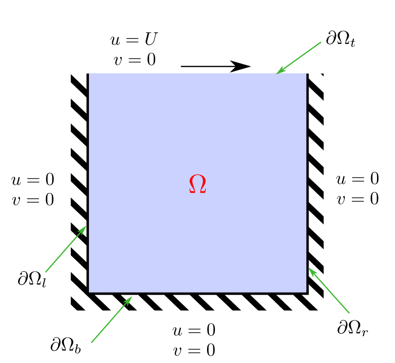

<!-- Improved compatibility of back to top link: See: https://github.com/krackalackel02/HPC-Coursework/pull/73 -->
<a name="readme-top"></a>
<!--
*** Thanks for checking out the Best-README-Template. If you have a suggestion
*** that would make this better, please fork the repo and create a pull request
*** or simply open an issue with the tag "enhancement".
*** Don't forget to give the project a star!
*** Thanks again! Now go create something AMAZING! :D
-->


<!-- PROJECT SHIELDS -->
<!--
*** I'm using markdown "reference style" links for readability.
*** Reference links are enclosed in brackets [ ] instead of parentheses ( ).
*** See the bottom of this document for the declaration of the reference variables
*** for contributors-url, forks-url, etc. This is an optional, concise syntax you may use.
*** https://www.markdownguide.org/basic-syntax/#reference-style-links
-->
[![Contributors][contributors-shield]][contributors-url]
[![Forks][forks-shield]][forks-url]
[![Stargazers][stars-shield]][stars-url]
[![Issues][issues-shield]][issues-url]
<!-- [![MIT License][license-shield]][license-url] -->
<!-- [![LinkedIn][linkedin-shield]][linkedin-url] -->


<!-- PROJECT LOGO -->
[![][logo]](https://github.com/krackalackel02/HPC-Coursework)
<br />
<div align="center">
  <!-- <a href="https://github.com/krackalackel02/HPC-Coursework">
    
  </a> -->

  <h3 align="center">HPC-Coursework</h3>

  <p align="center">
    High Performance Computing with OpenMP and CBLAS
    <br />
    <a href="https://krackalackel02.github.io/HPC-Coursework/index.html"><strong>Explore the docs »</strong></a>
    <br />
    <br />
    <a href="https://github.com/krackalackel02/HPC-Coursework">View Demo</a>
    ·
    <a href="https://github.com/krackalackel02/HPC-Coursework/issues">Report Bug</a>
    ·
    <a href="https://github.com/krackalackel02/HPC-Coursework/issues">Request Feature</a>
  </p>
</div>


<!-- TABLE OF CONTENTS -->
<details>
  <summary>Table of Contents</summary>
  <ol>
    <li>
      <a href="#about-the-project">About The Project</a>
      <ul>
        <li><a href="#built-with">Built With</a></li>
      </ul>
    </li>
    <li>
      <a href="#getting-started">Getting Started</a>
      <ul>
        <li><a href="#prerequisites">Prerequisites</a></li>
        <li><a href="#installation">Installation</a></li>
      </ul>
    </li>
    <li><a href="#usage">Usage</a></li>
    <li><a href="#report">Report</a></li>
    <li><a href="#roadmap">Roadmap</a></li>
    <li><a href="#contributing">Contributing</a></li>
    <!-- <li><a href="#license">License</a></li> -->
    <!-- <li><a href="#contact">Contact</a></li> -->
    <li><a href="#acknowledgments">Acknowledgments</a></li>
  </ol>
</details>


<!-- ABOUT THE PROJECT -->
## About The Project

[![][product-screenshot]](https://github.com/krackalackel02/HPC-Coursework)

This repository details the HPC coursework that involves the optimisation of a fluid solver in conjunction with the OpenMP and CBlas library.

This project involves the:
* Implementation of a proper project structure
* Creation of a Makefile that has build and clean up methods
* Optimisation of the default provided code with parallelisation with OpenMP

The executable will output the results of the solver into various text files in the "output" folder.


<p align="right">(<a href="#readme-top">back to top</a>)</p>


### Built With

<!-- This section should list any major frameworks/libraries used to bootstrap your project. Leave any add-ons/plugins for the acknowledgements section. Here are a few examples. -->

<!-- * [![Next][Next.js]][Next-url] -->
* [![makefile][makefile badge]][makefile url]
* [![cpp][cpp badge]][cpp url]
* [![openmp][openmp badge]][openmp url]
* [![doxygen][doxygen badge]][doxygen url]
* [![cblas][cblas badge]][cblas url]
<!-- * [![Cpp][cpp badge]][cpp url] -->
<!-- * [![React][React.js]][React-url]
* [![Vue][Vue.js]][Vue-url]
* [![Angular][Angular.io]][Angular-url]
* [![Svelte][Svelte.dev]][Svelte-url]
* [![Laravel][Laravel.com]][Laravel-url]
* [![Bootstrap][Bootstrap.com]][Bootstrap-url]
* [![JQuery][JQuery.com]][JQuery-url] -->

<p align="right">(<a href="#readme-top">back to top</a>)</p>


<!-- GETTING STARTED -->
## Getting Started

The following will show how to setup the repository locally and run the program

### Prerequisites

This is an example of how to list things you need to use the software and how to install them.
* Boost library
* Cblas library
* Doxygen
* Make / GNU Make

### Installation

_Below is an example of how to install the repository_

<!-- 1. Get a free API Key at [https://example.com](https://example.com) -->
1. Clone the repo
   ```sh
   git clone https://github.com/krackalackel02/HPC-Coursework.git
   ```
<!-- 3. Install NPM packages
   ```sh
   npm install
   ```
4. Enter your API in `config.js`
   ```js
   const API_KEY = 'ENTER YOUR API';
   ```

<p align="right">(<a href="#readme-top">back to top</a>)</p> -->


<!-- USAGE EXAMPLES -->
## Usage

<!-- Use this space to show useful examples of how a project can be used. Additional screenshots, code examples and demos work well in this space. You may also link to more resources. -->


### Makefile
#### Build Source Files
***You can list all the files that will be buit into individual executables***

***1. choose file as main that will be built into "solver.out"***

***2. list any other separate binaries that will utilise the other headers in "PHONY_BINARY". E.G. ./code/src/main2.cpp***

***3. list any other separate tests that will utilise the other headers in "PHONY_TEST". E.G. ./code/test/test1.cpp***

_Makefile Snippet_
  ```
  MAIN = LidDrivenCavitySolver
  PHONY_BINARY = $(MAIN) main2
  PHONY_TEST = test1
  ```
#### Development
***The development process should involve publishing and then comitting and pushing to main and then ghpages***

***1. make***

***2. make commit MESG="this is a test message"***

***3. make push***

***4. make publish-docs***

_Makefile Snippet_
  ```
  docs:
    cd ./docs && doxygen
  docs-open: docs
    xdg-open ./docs/html/index.html

  git-commit:
  ifndef MSG
    $(error MSG variable is not set. Usage: make git-commit MSG="Your commit message")
  else
    git add .
    git commit -m "${MSG}"
  endif
  git-push:
    git push origin main
  git-publish-docs:
    git subtree push --prefix docs/html origin gh-pages
  git-log:
    git log --name-status > repository.log
    make git-commit MSG="Updated Log"
    make git-push
  ```
### Solver Executable
_For more instructions, please refer to the [Documentation](https://example.com)_

1. Call make clean to empty any old build files
   ```sh
   make clean
   ```
2. Call make to build main and unit test executable
   ```sh
   make 
   ```
3. Run main and unit test executable
   ```sh
   ./bin/solver
   ```
4. View output files and resulting ".txt" documents
   ```sh
   xdg-open ./output/final.txt
   xdg-open ./output/ic.txt
   ```

<p align="right">(<a href="#readme-top">back to top</a>)</p>

<!-- REPORT -->
## Report
The final report for this coursework is located in the "./report/" folder. Furthermore it can be build using latex, if the correct packages and xelatex is installed.

_You can view the document below:_
[![][report badge]][report url]
[Click here to view the PDF][report url]

<!-- [View PDF](./report/Report.pdf) -->
<!-- <div>
  <iframe src="https://github.com/krackalackel02/HPC-Coursework/blob/main/report/Report.pdf" width="700" height="300"></iframe>
</div> -->

<!-- ROADMAP -->
## Roadmap

- [x] Setup project structure 
- [x] Initialise .gitignore file
- [x] Initialise Markdown
- [ ] Assignment Tasks
    - [x]  Task 1.
        - [x]  Setup Git repo
        - [x]  Setup git log file to report previous commits
    - [x]  Task 2.
        - [x]  Implement Makefile
          - [x]  Main executable should be called "solver"
    - [x]  Task 3.
        - [x]  Add Doxyfile
        - [x]  Document all of source code
        - [x]  Compile with "doc" Makefile target
    - [ ]  Task 4.
        - [ ]  Write Unit Tests
          - [x]  At least one test for Linear CG Solver Class
          - [ ]  At least one test for lid-driven cavity class
        - [ ]  Add relevent documentation within test files
        - [ ]  **Report:** Provide brief description 
        - [x]  Compile with "unittests" Makefile target
    - [ ]  Task 5.
        - [ ]  Implement MPI
          - [ ]  Extend the code to execute in parallel using P = p<sup>2</sup> MPI ranks for integer p > 0.
          - [ ]  Other choices of P may be considered erroneous and your code should terminate.
          - [ ]  Parallelisation should be achieved using domain decomposition with each dimension of the domain partitioned p ways.
          - [ ]  **Report:** Provide a scaling plot showing the speedup of the code when run in parallel, relative to the case in serial, up to P = 16 ranks. 
          - [ ]  **Report:** Concisely summarise your approach to parallelising the code with MPI and the changes you needed to make to convert the code to run in parallel.
          - [ ]  **Report:** How did you try to ensure the work done by each process was as balanced as possible?
          - [ ]  **Report:** Discuss the scaling plot and whether you consider it shows good scaling and, if not, why? 
    - [ ]  Task 6.
        - [ ]  Implement OpenMP
          - [ ]  Add multi-threading to the code using OpenMP
          - [ ]  The number of threads used by each process should respect the value of the OMP NUM THREADS environmental variable.
          - [ ]  **Report:** Provide a scaling plot showing the speed-up of your code when run in parallel, relative to the case in serial, using up to 16 threads.
          - [ ]  **Report:** Concisely summarise your approach to parallelising the code with OpenMP.
          - [ ]  **Report:** Discuss the scaling plot and whether you consider it shows good scaling and, if not, why?
    - [ ]  Task 7.
        - [ ]  Optimise your code using a profiler.
          - [ ]  Use one MPI process and one OpenMP thread for this part.
          - [ ]  **Report:** Describe, with quantitative evidence, the most time-consuming parts of your code. 
          - [ ]  **Report:** List optimisations you have made to the code to improve performance, and quantify the change observed.
    - [ ]  Task 8.
        - [ ]  Use good coding practices (code layout, comments, etc) throughout your code.

See the [open issues](https://github.com/krackalackel02/HPC-Coursework/issues) for a full list of proposed features (and known issues).

<p align="right">(<a href="#readme-top">back to top</a>)</p>


<!-- CONTRIBUTING -->
## Contributing

Contributions are what make the open source community such an amazing place to learn, inspire, and create. Any contributions you make are **greatly appreciated**.

If you have a suggestion that would make this better, please fork the repo and create a pull request. You can also simply open an issue with the tag "enhancement".
Don't forget to give the project a star! Thanks again!

1. Fork the Project
2. Create your Feature Branch (`git checkout -b feature/AmazingFeature`)
3. Commit your Changes (`git commit -m 'Add some AmazingFeature'`)
4. Push to the Branch (`git push origin feature/AmazingFeature`)
5. Open a Pull Request

<p align="right">(<a href="#readme-top">back to top</a>)</p>


<!-- LICENSE
## License

Distributed under the MIT License. See `LICENSE.txt` for more information.

<p align="right">(<a href="#readme-top">back to top</a>)</p> -->


<!-- CONTACT
## Contact

Your Name - [@your_twitter](https://twitter.com/your_username) - email@example.com

Project Link: [https://github.com/your_username/repo_name](https://github.com/your_username/repo_name)

<p align="right">(<a href="#readme-top">back to top</a>)</p> -->


<!-- ACKNOWLEDGMENTS -->
## Acknowledgments

Use this space to list resources you find helpful and would like to give credit to. I've included a few of my favorites to kick things off!

* [Img Shields](https://shields.io)

<p align="right">(<a href="#readme-top">back to top</a>)</p>


<!-- MARKDOWN LINKS & IMAGES -->
<!-- https://www.markdownguide.org/basic-syntax/#reference-style-links -->
[contributors-shield]: https://img.shields.io/github/contributors/krackalackel02/HPC-Coursework.svg?style=for-the-badge
[contributors-url]: https://github.com/krackalackel02/HPC-Coursework/graphs/contributors
[forks-shield]: https://img.shields.io/github/forks/krackalackel02/HPC-Coursework.svg?style=for-the-badge
[forks-url]: https://github.com/krackalackel02/HPC-Coursework/network/members
[stars-shield]: https://img.shields.io/github/stars/krackalackel02/HPC-Coursework.svg?style=for-the-badge
[stars-url]: https://github.com/krackalackel02/HPC-Coursework/stargazers
[issues-shield]: https://img.shields.io/github/issues/krackalackel02/HPC-Coursework.svg?style=for-the-badge
[issues-url]: https://github.com/krackalackel02/HPC-Coursework/issues
[product-screenshot]: ./images/screenshot.png
[logo]: ./images/logo_big.png


[report badge]: ./images/report.png
[report url]: https://github.com/krackalackel02/HPC-Coursework/blob/main/report/Report.pdf
[cpp badge]: https://img.shields.io/badge/C%2B%2B-white?style=for-the-badge&logo=cplusplus&color=%23084a86&link=https%3A%2F%2Fen.cppreference.com%2Fw%2F
[cpp url]: http://cppreference.com/
[makefile url]: https://www.gnu.org/software/make/
[makefile badge]: https://img.shields.io/badge/Makefile-white?style=for-the-badge&logo=data:image/png;base64,iVBORw0KGgoAAAANSUhEUgAAAC8AAAAtCAMAAAAJMcKVAAACglBMVEVHcEwGBgYNDQ0PDw8HBwcEBAQEBAQDAwMDAwMKCgoVFRUREREFBQUsLCwBAQFQUFAJCQkKCgoCAgIFBQXU1NSNjY2IiIgJCQkGBgYSEhK2trarq6tKSko8PDxVVVXKysp2dnYEBAQFBQVGRkYHBwe4uLjDw8MmJiZ2dnZCQkIEBARXV1fMzMxVVVWIiIiFhYWamprT09OWlpZubm5SUlKgoKCUlJRubm5VVVUFBQWEhIQICAhra2uurq5ERETHx8c0NDSRkZFvb2+goKBcXFyFhYW9vb3Nzc1PT0/CwsKIiIhvb29mZmZ/f3+zs7OIiIg0NDSlpaWSkpKnp6czMzN2dnahoaGampoNDQ0FBQU1NTVQUFBBQUFcXFxbW1tvb28nJyeysrK1tbUODg4DAwMGBgZ3d3caGhqvr68GBga5ublkZGR2dnaHh4eoqKiNjY1AQEBjY2NUVFSUlJReXl4EBAQpKSlkZGQ4ODgGBgYwMDChoaFycnJ8fHyYmJgFBQWpqak+Pj5PT08uLi7T09NkZGR/f38hISEnJye0tLTPz8//AP8A/f7///8AAAD9/f3+/v709PT6+voMDAzx8fH39/cCAgLe3t7W1tbIyMjk5OT8/Pzn5+fGxsbv7++Li4vAwMCqqqohISGWlpawsLAYGBgSEhKZmZnq6ur29vba2trMzMxvb2+3t7eGhobs7OzR0dG9vb3i4uKnp6etra0nJyehoaFiYmKdnZ2kpKQrKyvDw8OQkJBMTEwGBgYcHBx1dXVsbGxISEj5+fmzs7N4eHhdXV3Pz89+fn47OzuTk5M1NTVVVVVycnKfn59DQ0N7e3uDg4NmZmYvLy+6urpaWlo96Q2sAAAAjHRSTlMADxkdFgIEBgwgSCgSYgn+OS8Bt/6/pkFWNOL2OFFp+aptiIuS+vpAoUH5WudRs83w98F5cPLd5ct9iPbB7HbzJvOXw0m/7/B29N+Ooqrs8ETwrOQvw/vPT2R0tJek6vCpxfd5nKjygeGY8Yh1/MnPWHF969ba1bXe5+mp1WfV57siqYb89eGW8Nb2YhezLdUAAAVnSURBVEjHjZX1VxtbEMdvQjyFQHD3YsVb6qXu7u7u8tylT8/ZkN04xI1AjLgS3F36/7y7G8orHEo7P+zd3PvZme/OzE4AwI108kj1m/N+1Z9Hs+PAUqOerU9JTj5WX0Za3KKfLH1YbB0enpmdUB0+krWTsnhCiyO/elGjanUH1maknKRHNxk7zkhdY553Myq/bt4hPb6tZJGnFO7JtU5OD/dwpnrMZ9YTseN2PJb1Gma9G5J31x/J21dXlcP433/O84x/np9OqasZ7h0ZPb4ej/Byu3nK0FO8L5tCA1QGmcz4UD2XfHYnmUGnVNadH9F6t2cDQK5SzvA6c0uZ75GYssrKdOIhStberDULu8wUd9eIJJkJXja2jxj8ye9xcv2tdQcaM1LKaPTKPesOrLv140Jezl7wGfQHckCeXW2cy6xYdJMksw2OW1wPD26+3j/8rttauyUagrrlmWDGlAcaRK2CzhcL7mOOdYQ9ER6P16XK7Pb1jAl4hoFDW6IR9p7o8pkaQKZoOtJdFd2ilKp7BDwxNJ4x3KbQt8IHIoOPn9Lww6yaYK9pA9Bjtsj4MYInPSn2RXhiHm5iCyZXOwcFPF5kImMvwZ/QcuwBcArzGgercT1xr29boBZBl6erq1Plt7dIFLYpgUBsDP/yKzyu2KW1oOdBA9pqDG6AlWAc3G4zejgWl3moX2FCpPPtIQUq7fZOBz3+73cCyukZQY/pDThnUgQN/jNPsnefGghOd6AYKrOpMMSpN6tH51FFQNJinvLo6p6ezuw1+u3nwMF/Jb08rSb30GjvnF6EIFhgWqtrQuUBhUhjneSErEJEFjQM6l2DYq269jVgX7BPCMRaTo/B6EWgyVQOlUSqCAmH5EKlb0KuliP8VoE4aBBHxqUX2IC6Ptf8DqZBzJtFId5mlotEyvahVqlUjSgHNCG3EkGcYzBjAo6iMYcLk54n6ej2wBAy3H1LH8pX2sbnfEmoFOsL92p9cqhxINI10p30djdRava+9ub+7qmJNpxHIGZX2bQ2lI/xEWmnZ9QENztGLEPy2tKYaBewjx6XyHX9BI44FXy+0zHpkOLq+HpfWImvmoH9e16R37cwKfto9Y12AudrHPCKoUoJEQ51+W8L4So6HBtD/eC7iGN+bSf49llrNA4/ukie/Zb8FobavyNmyRhgnsPdIKawJtREgH3SkKyZj2C635k5VRm1uT+UfIjTLjsI8aP9IgkuHGmy2txqjRpFJNtiY+NLKirKlgwa5jY7IpJkXvc2IS0thHCLRWGyh6xypPlQYx5j2VBiXltrCty4EvtAT0hXiqAOd3jchTabYXr4PzGX8bH3d228WbQGsGrw1xSF5BgiRN2tbgWCYfB39TKeGx/Lik+9QwOpu3AxTSLU7LQjfD6sHV7y4sLlQxK3+M10wLwSrQLSrmkmkgQT5KwppKyAg3TIg8vqKN/nSloog1O/KWElHLALYDexvli7EMCrjN40NSVdI63EkwrYcFSnbnKICMwRkAiFpg79pFdXyFiJp+Wn4te0jVHHWEgXDvtdAd0fD1aUD0DqJbyjLp5Ao0KQNrkcv93PWhkHa/LxNDOvbnSLosrR5g61df5wwkd4EJ+Gz3dS/lchDDrmd1g6x//+K7aE/jGefjGei0/Fm5pwP2xSpVo9tIkMVjFSGh47/RuVoVMWfemG9NV4QGExuYBx57utWzVEEeSnWKvygMSGuaanJSZyzLBQA/evUlbnARWf3ey7lxLHZLo5QREJfIbR89PId43DWp44MZ5B436SpyaQEu59GzTC/40vi9Kpnw5ApcawCraWl/9cXv6I/DmKAJdOKUhMLHp0j0VbevAfLjl63EAhMlYAAAAASUVORK5CYII=&color=777777

[doxygen url]: https://www.doxygen.nl/
[doxygen badge]: https://img.shields.io/badge/Doxygen-white?style=for-the-badge&logo=data:image/jpeg;base64,/9j/4AAQSkZJRgABAQAAAAAAAAD/2wBDAAMCAgICAgMCAgIDAwMDBAYEBAQEBAgGBgUGCQgKCgkICQkKDA8MCgsOCwkJDRENDg8QEBEQCgwSExIQEw8QEBD/2wBDAQMDAwQDBAgEBAgQCwkLEBAQEBAQEBAQEBAQEBAQEBAQEBAQEBAQEBAQEBAQEBAQEBAQEBAQEBAQEBAQEBAQEBD/wAARCAAZAFUDASIAAhEBAxEB/8QAHQAAAgICAwEAAAAAAAAAAAAABwgABQEDAgQGCf/EACwQAAICAQMDBQEAAgEFAAAAAAECAwQFAAYREhMhBxQiMUEIMmEVQkNRYnH/xAAZAQADAQEBAAAAAAAAAAAAAAAAAQMCBAX/xAAqEQABAwIEBAYDAAAAAAAAAAABAAIRIaEDBDHREhRBcQUTFUJR0mGx8P/aAAwDAQACEQMRAD8A+mOX33tXD2Z6F3MwxWK6dUw6WZYORyO6ygrH48/Mjx5+ted9O915e8LD7kzNexAMLjsv3zCkCw99ZTICQeCg7YIJ/OfOh/tKzgsxF2N5bgnoV4MGL4Hv3q9y68svvJ2KsO5KjBRweeAeOPOurTy1m3LW9/AvblhwMVyBowiMyxXHjjZAAApmWP4cccgDj816AykBzBrSuy5TjGQ7ojXR9Qdn5G1DUq5qIvZborl0eNJ2/BG7KFcn8Ck8/mt9fem1reZk29XzdV8jFK8DVw3yEiL1MnkcdQX5cc88efrQYa1t1tpYK/Z3FPfyGdrTtn4psg8vKCvI8rvEWKwmGZUCkBSh4A1NyZjBy0MNPui4U/5HB07e4g8jR9uXpQVpgy/JZ2PcU8fcfPPhV5wMmHEATWbf36T84gIqN6tenKTe3bd+N7nbabpEhJMY55cePKeD8h4/3q0zW89r7digmzWbqVI7SNLC0j+HQccuCP8ApHUvn68jQnxUUEmzchvEMs2fwuSNnKQR+FiqxqYzWiA/7HtHLJx4P2flzxTbfbKbiy+O2dYSQojRYlXY+J8XTczvKP8A1lLVov8AfS2nyjTJBoNUecafnRGvI7+2libktLIZuvDJAAbBIYpXBHIMrgFYvBB+ZHgg/WtuL3rtXNUbOSxmepT1aSh7EwlCpEpXqDMW44Ur5B+iNAzCZLbtujMm8s5aoxphWnqJHakhM+SeSb3b9KEd2cSdA6G6jwSOkgnXCLL2JrANxQEZ8Ys8UaKUM8WOnkijCf4kCVepU+iyKPrT5HoJmyXMdUcsbvrauXuR0KOXjaecFoEkR4u+AOT2y6gSePPx58edaLPqRsepdmxs+46fvIHeNq6lmlZ1bpdVRQS5UnghQeP3S5T7hyWOwMd27cs2DkKHuK8rXo5ZHtKUeK5IPcymF0k4BKqgHWVP0F177B1Yd1b5g2/l3nSOG3nrEq1rDwv1+4jHQJEIcJy5PAIBKqTzwNN2SawFxNINkDHLqAVRlwufxG4KrW8PejsxxuYpOnkNG4+1ZSAyngg8EA8EH91NBLZe6cs1yS1HdkexNiMeLMpPLSukllAzH9bhRyf9amo4mVLHESqsxOJsoO7oj/pLM5u9cT0j9nHNdmlaGrj7BjkbrYCUHvnpdlAJePo5J58E86mDn/pPA47IYlPRlL1TJwQ1p47+OuT8RQ89tVb3QZeksSG56ueDzyOdOwfvU1f1I8AYWCO7vso8qJniNtkjEND+kRaae36TTXonZWkr2cdZMc3SeQJSs6vKAfx2Yf8AnnVlDb/puPcsm6JvR9bdmSy9vs2sdakrrKydHUIzZ48J8FBJCr4A06uppnxMvqcMfHu+yBlAPcbbJSPTJf6CxGZydm76az0qk2PWqUNSaSJYu4eI1hlsfPpDHp+XKqWHkHjVlKPXzYl+td9PvS18hM2OSmJspEJBFBHxwpWOdCskjgs3khUSMeSxCtPH9trLfepOzxcTLBXXXebrTcuGxU22SuWNueoN1ZcpufYuXe3nIDLZqxQSRwpM/PydKb9LMAel0k46ioPWQTz0Mnj/AFrwNazt3a/pGb9DIwVfcPkYe50LBGqVxGYZ4ykq9LSMwPxZkVSSrHTZn8/+awf8jp+oPgAtFO+6OWEyCbJKKG3v6Xp5BMhN6ZR3wkqziC1U5iaRTyrSBbCmUg+R1lvPn786ssU/9XYjdNjdtD01ri5YNhu3LTZ4IzO6vIUU3Bxyyg/Z4/NOJqaq7xNztcNt91kZUDRxtslj9HNn+tNezmZN47QiqxtFVSmJCU4UPOzIo77+F61Png/L9/Jpn4/3U1y4mafiuLzTtO6szBDG8K//2Q==&color=8face7

[cblas url]: https://www.netlib.org/blas/
[cblas badge]: https://img.shields.io/badge/BLAS-white?style=for-the-badge&logo=data:image/png;base64,iVBORw0KGgoAAAANSUhEUgAAADIAAAAyCAMAAAAp4XiDAAAB3VBMVEUAAAAmJiMHHAUg4gsAAgDv794DFQIpKSa7vKuWmYnW1sbm7M8DEAIFJQIHHwTo784DCwISSwyXmorZ2siMlYMHKQOUlonp7tMmLCK8vKwDBwMTswLS18IY0QUdnA+RlIgJWwEbaxQdwAzi5c/J8LcPQgkQVQkOagRY+EOXmYkeLBzd78gcjw8FPADh78ve4sy2uqYSkgUc3QgMNQe38KZI/DJS+j0ZhA0ILAQUegkXWhAy1x4g1w0htRCwu6CovZjZ28kaGRjS8MAPPAsl5hDY7sWx8p+I9nUhIB52dm2oqprQ6L+QkYbO1r1G8DEOnQCIl3/A8q+R9X9q+FV39WUSuwDX5MYt8xfH1radv46GynZXok0WYg0eyQwVowYX6QIOKgwUbwnQ0MCp8piZ9IcHTQA5+yIlwRM36yOH7HUx+hnB2bGx2qEWlghqqFwdzgqTxIM74yhwnmN4nG4QZAcqyxhi+E2IiH5b5EhK3Dft79rY2cjm785fXlc39SHC6bGGhn2p65ghqxFR7j194mtuzF+W3YUv7hlw5F160Wl+m3QLLwcf8glv+Fui9JE3xyaytaKc3YsFMAFioVco9xEfpBDDw7Ia/gGU7IOv4Z5Z0UfExLPD3LIAJgUmHAvxfI0MAAAFEklEQVRIx52W90MiRxTHETaIlHX3ApgDRKUsGJAiHUFPaRbwLESRgJ69Ehu2g7PXs596LfljM9tgUfwheT/t253PvHnzZt5+Waz/YbL2zorKslZRUfkbZfgz/qazXQaQ9k9dW1GptPENw6qkdWJxX9/n9bW/CFtb/9wnFkej+12f2gHS2VXXbXnLMN5bnqW1bSR5cb6900Lazs72SXKk7a67rqsTIBVb3X9P8HO/kpbj8xWxxNLp+dHqrFKHSkSEBVIu/+rR+Wlb934FjkQtE2a1oAY3gUCgNvf8mNev+scvhaUpX47P9h6PbOFIpZTHV3/8hbCP1fmQPeJs8VzKyIFC+oFwsNtkH4XkBBRRY9IMHG2Mw/QgiRezMSKJNi5IpIqXqyGImrxmSn+LcQtDJFoEbioSXH9vshSpMfXH54wwY0hKyAoEir5n4XyEiXysMYQ3N1CoOAJJARwtTmEL6u/bxJUFBBCT+ieYuUcoCCDzIrQLjc7MLxURsMUdA70uLpO4xCOy0eIMw4MHi611FMIX5EMDc7qSOnBT+Pxad+GF1TG1l7BU0YjacNNbSrC0ErAWTMmmfbZvMKyJ8RopRDEU1rugEgLGgA83f5umX9TvDmh6FBTSyIvZNw9LjwfixadHMnJJIXlnuGNIwauikMT8hujZssBuBTyITCZ0keWHfdf9ITO/gPwTV8pKc/cCv6EWRIaD9eQcwxGNiYEk5nfHSxAUXw+JcEjEMzPVkVcXkZh9MNjEzB1lcTGkBMk4JkN5AQPpmXT6yTIjYEUQKmQ1+dg0gn9AZvV2Q16Q41UVNlkTGcbrnBr1ZxCh1adD3l8ZG2q5Hh3MSaez4KqkN+2GagbCN4fCDiUohHHM02ybHhsdc+uuUgD54z2bY1XJIZZwebDfxIzCV5s0g8vghBnT7mZ02pcdkzRxPlBIvbIsIsh3RM5AAYwqd7PXWgZBZjf7S3LJCfKGgeEmEvFkgsoXCKR0luaSE1QXkafs44YKfoawXI7JZ1GqDZGgm0A449NBG8J6jmC7oJSFupC5XKsQMgo6zdGmhM8Rti+uMan5zB2zO/AjY1Rd4sj4i1zAJ2e4eCzxunREWkQEkr0CiAdHAhSSfSIQ21xEM1S8L4qhSSdxLl0qazMqqV2WCyU+ZYOKK7eyfelmK3FhMs7JnlghSuJA7ydaBRdDRULoyxcuCxKJuCIIZsskuEe0yln9waJFSiDS1nv9LHX7MHAZdbW6sv8ud1p/SnWYupUjv4i+WmDZo9/kUFlG4t9eIfuY+OKQbmABLcBcHtsr/8gPt0ka2aC7FWgSQoz92l9Vqzqio6z0qsgwMkwGoZJXAEQXdMxTDVbcdjxjJe4khMq02lcIduZR/32JTr91Kb5AMJDXqy2fOYKlZwZv9gqbbFm0x2dG8ZzZcFlAiPmHnZGwhlHKWE//gCPoKj+eBWdVj474TX+HwUx3Syk4MCHN1OaCzyN6sSxuIONbcFxP2TUhUx4gxMIqoncT78xDewfz+gXOaNbGhUgOgtjubGb5asYZ/x7e6xkyq9XmCUuU+O/vd3+dUCgSi0v3x9u9C8G0/NCl0+mMh3JfcHj3aPv49MfSYiKmUPD5E19JqYALkjsgQlqBCFlJnvzcWZ2bOzs7m1td3fl5cpJcGRlpa7XwCLNQgoSUPY1vgNIBOmd9be3hT9IeHtbW1gm9UycltVB0i5Q9THGF66jfGYb7TOVFiav/bP8COtQ/bwHPY+gAAAAASUVORK5CYII=&color=090d16

[openmp url]: https://www.openmp.org/
[openmp badge]: https://img.shields.io/badge/Open_MP-white?style=for-the-badge&logo=data:image/png;base64,iVBORw0KGgoAAAANSUhEUgAAAJsAAAAyCAMAAAB8rFmYAAAARVBMVEVHcEwIdH0IdH0IdH0IdH0IdH0IdH0IdH0IdH0IdH0IdH0IdH0IdH0IdH0IdH0IdH0IdH0IdH0IdH0IdH0IdH0IdH0IdH2BGXldAAAAFnRSTlMAE73tBd+j+1JysgnTgh1hKo83SHich9xJLwAABHNJREFUWMPtmNuWpCAMReUmggiI4v9/6hBAxGv11PTq6YfKQy87WrgJJwnYNB/72Mc+9hvNtMW8zT40bs6Z1o+03vtxEJOmD0MiOxnTOfTPbOOymci+iW8+3DftcjTOyjxOZgdFOF84UX7qv49N5mjMywu2YKy7jtnAqilI921sSkcXlV9gW9jVey2GW0RhjBkEn5nvYuNTdGn2FbZFnlfMKuAZHOppbw0OdMR8E9syn+S2Y+OEVLfIKXAIAi6LEvuZ3IT3HbYkuGG5ZuOzc5Np+X4mlYlwq0UHh+z/lS0FhOkiN07ObFH+tMzGH4bSqkg2G23XX+XAarQvPhQhdCxHPUJ9zcYVK4JLciP4hq2x7JDWpVSGynGQlyPxMSQG0dOuVUy1ZgusnaVSSoqkAmqGWTd6xkrhVH5yFGTKzaHITfk7NqSu2SBITDcnH7EwXeZ8EgPH7lhumIGRKF646/Lg3OuNbV5Jstz8cMc25dVe2sOSsnMoGxOeM3AL1oFgqfiaHqhN1QY8fKBRS2Qkoa6z+AJPC1t6I7NNnxbT3LBRi1e9Def1G45yBucIbGG9W9tTZMIMMEqy5W2oNmiSSQuBLfQTZay2gsUysLJplV+f5ETcBVs7D6Nkh2pYrDvLLeWHTBJuk8I7EpsjxGJMHohgyKGYg1iXh+bC1ieCEV4BckPDq9qL0Wn5jrjhvRiGADaW6x718ae+GiCEI8wK2EgeAK59YWtERslya16xnWJ0ydYXtrHZdhLEgWeuM6aNPLjfSpvc2BxJa5nl9ootyvfE1t2ybdiAZRyvJyJgoYCtpNcAebWy0VQaeErskPfPbMqcdnCXeoNRJYU8tTXuDBORfjUM1QfYSnDnHVtGiNsHkMI9G2dY6HOHceSijdk1T7fK1wODOE6WWGAbqrjhis1UT47NFdtojDDGTPayRUJKttfBDGyqZE7UuYg7h8rYI5sjO53f1t47u+oLIOfcF3S9pkNgY5OtrX9iK70oDvf3bLGfisOSpl4BenO1BI1ZKgVu8bxja3y9MXqDDV6qdi+Mxb+LqbmlSVgf4twucWznNH1kM7Xc3mCDwC0SHR39odWOUDBS/m5qIBg9sllSQ7zBFntLte8VJO+OgY3kX7tUdeeqencxmR/Z0NrFY3t5g63ROJ8XKO11J8t5IfZTNkGcoLbDBhSymhhIeDqljvbIVvbnsXNcs1H7dCamWqZzlpS7cxawhU7VGuFLBIGI49mIlqQpPLMZXm1+rtmsMNPjmX6+Op9CLnh2ONlOVV2ALkPxE1sWXFq7i9ob/C6U3ufDiR0wHD525/rYT50M/vqLgB0VeILLpQ2KUqUEGaU8nVW0kUYtx+u0hxLpRth+DipbaM5o6uwr1Z2/h6Re38PEdl9SkOvAtf5XDjHxQIPiH7D1brnebqxX8URE3znS7fYhv8z+O9s039iU2az4Oev2CeuXG/OZzSw/Z/LIxi9tY+M/Zkc2192Yy2y6+zn7+hcirQj5rXkaOt03fP792Mc+9rb9AeUGuqWYp4OhAAAAAElFTkSuQmCC&color=001f21